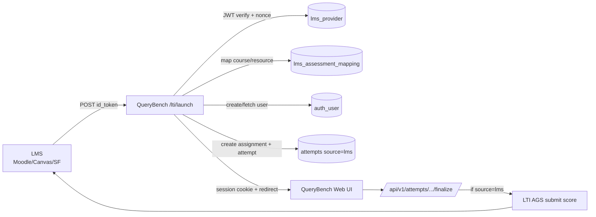

# LTI 1.3 Integration

## Architecture Diagram



## Endpoints

### `POST /lti/launch`

Validates and processes LTI 1.3 launch token:

- validates JWT signature via LMS JWKS
- verifies `iss`, `aud`, `deployment_id`
- validates nonce replay protection
- validates timestamp freshness
- extracts:
  - `sub` (mapped as `user_id`)
  - `email`
  - `name`
  - `context.id` as `course_id`
  - `resource_link.id` as `resource_link_id`
  - roles claim
- maps `(provider, course_id, resource_link_id)` to QueryBench assessment
- creates/loads QueryBench user and session (`attempt.source = lms`)
- logs in user server-side and redirects to assessment UI

### `GET /.well-known/jwks.json`

Returns tool public JWK set for LMS registration.

### `POST /lti/submit-grade`

Request body:

```json
{
  "session_id": 1,
  "score": 82,
  "max_score": 100
}
```

Behavior:

- finds LMS-linked attempt/session
- obtains AGS access token from LMS token endpoint
- sends score to lineitem `/scores`
- returns:

```json
{
  "scoreGiven": 82,
  "scoreMaximum": 100,
  "timestamp": "2026-03-11T10:00:00Z"
}
```

## Data Model Additions

### `lms_provider`

- `id`
- `name`
- `issuer`
- `client_id`
- `auth_url`
- `token_url`
- `keyset_url`
- `deployment_id`

### `lms_assessment_mapping`

- `id`
- `provider_id`
- `lms_course_id`
- `lms_assignment_id`
- `querybench_assessment_id`

### `attempts` extensions (assessment session)

- `source` (`standalone` | `lms`)
- `lms_provider_id`
- `lms_assignment_id`
- `lti_context_id`
- `lti_user_id`
- `lti_resource_link_id`
- `lti_ags_endpoint`
- `lti_lineitem`
- `lti_ags_scope`

## Local LMS Testing (Moodle Docker)

Use `docker-compose-lti-test.yml`:

```bash
docker compose -f docker-compose-lti-test.yml up -d
```

Alternative quick container:

```bash
docker run -p 8080:80 moodlehq/moodle-php-apache
```

Test steps:

1. Create course in Moodle.
2. Add external tool activity.
3. Register QueryBench as LTI 1.3 tool.
4. Configure launch URL: `https://<querybench-host>/lti/launch`.
5. Configure JWKS URL: `https://<querybench-host>/.well-known/jwks.json`.
6. Launch activity from course.
7. Complete assessment and submit.
8. Verify grade appears in LMS gradebook.

## Security Controls

- JWT signature validation against LMS JWKS
- issuer/client/deployment validation
- nonce one-time-use validation
- timestamp freshness validation (`iat`, `exp`)
- HTTPS enforcement for LTI endpoints (strict in non-debug)

## Logging Events

- `LTI launch received`
- `JWT validated`
- `user provisioned`
- `assessment mapped`
- `session created`
- `grade returned`

## Backward Compatibility

Standalone flow is unchanged:

- login -> dashboard -> start assessment

LTI launch flow bypasses standalone login and creates LMS-sourced session directly.
